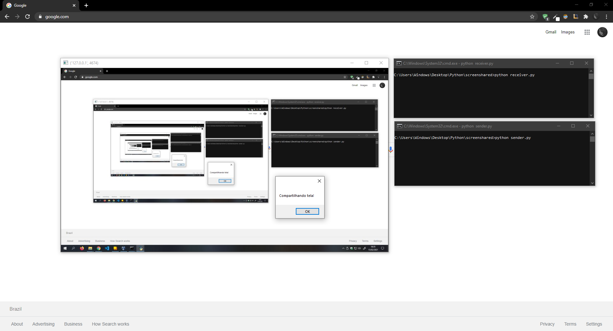

# Screen shared

#### This is a prototype of a screen sharer

## Language
 
<code></code>

 

## Preview

### Installation

git clone https://github.com/LuciLua/ScreenShared

#### How to use

python  receiver.py
python sender.py

### Stop

STOP